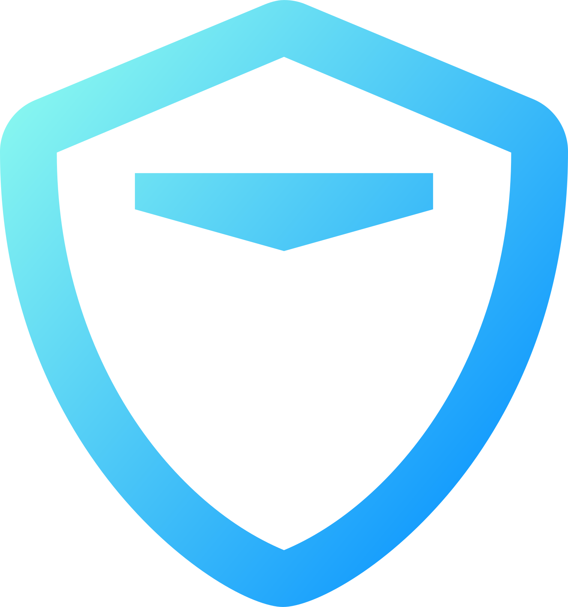
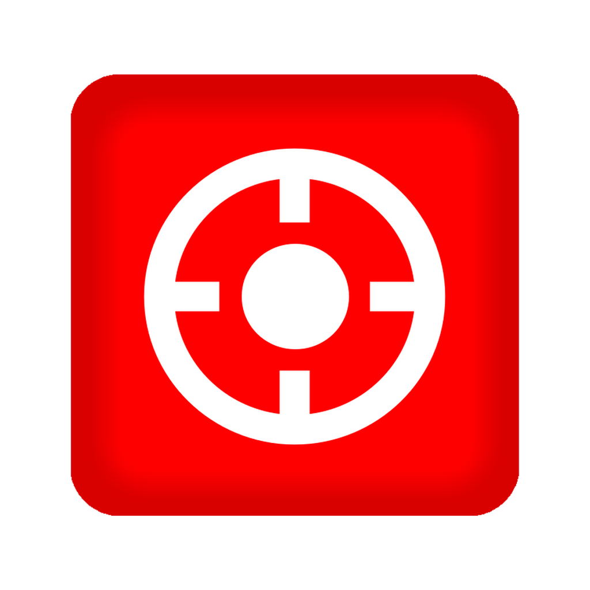
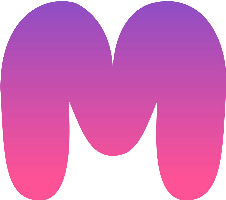
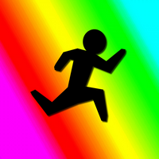
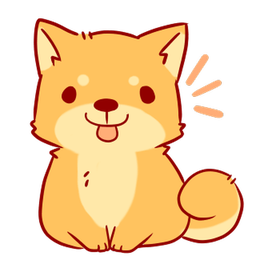

  

 

  

  

 

I am a **French developer** 🇫🇷 passionate about **technology**.

My interest began in childhood through **video games** 🎮, where I wanted to bring my own ideas to life. This passion eventually led me to **software development**.

About five years ago, I discovered web development with **JavaScript** and **Node.js**. In the past three years, I’ve focused on **React** and **TypeScript**, which helped me improve my skills and write more structured code 🗃️.

Today, I aim to deepen my expertise and build a **professional career** in web development 💼.

I’m also a **cybersecurity enthusiast** 🔐 and occasionally participate in **CTF (Capture The Flag)** competitions 🏴.

I also have a growing interest in **lower-level programming** and would love to explore languages like **Rust** 🦀 to better understand how things work under the hood.

 

 

  
  <h3><a href="https://github.com/Ralex91/Rahoot">Rahoot</a></h3>
  
Open-source Kahoot! clone you can self-host for smaller events.

  
  <h3><a href="https://github.com/GuildSaber/GuildSaber/tree/dev/src/GuildSaber.Website">GuildSaber</a></h3>
  
Clan ranking platform for BeatSaber — Front-End Developer.

  
  <h3><a href="https://github.com/Ralex91/BeatSnipe">BeatSnipe</a></h3>
  
Bot that tracks scores of players you want to snipe — auto-generates and updates playlists.

  
  <h3><a href="https://memocord.ralex.app">Memocord</a></h3>
  
Collects Discord memes and brings them together in one place — share them or discover new ones.

  
  <h3><a href="https://rage-deathrun.ralex.app">Rage Deathrun</a></h3>
  
Game server on Garry's Mod running the deathrun gamemode.

  
  <h3><a href="https://doggy.ralex.app/">Doggy Bot</a></h3>
  
Discord bot with a soundboard system and cool extra controls.

 

 

  
  

 
